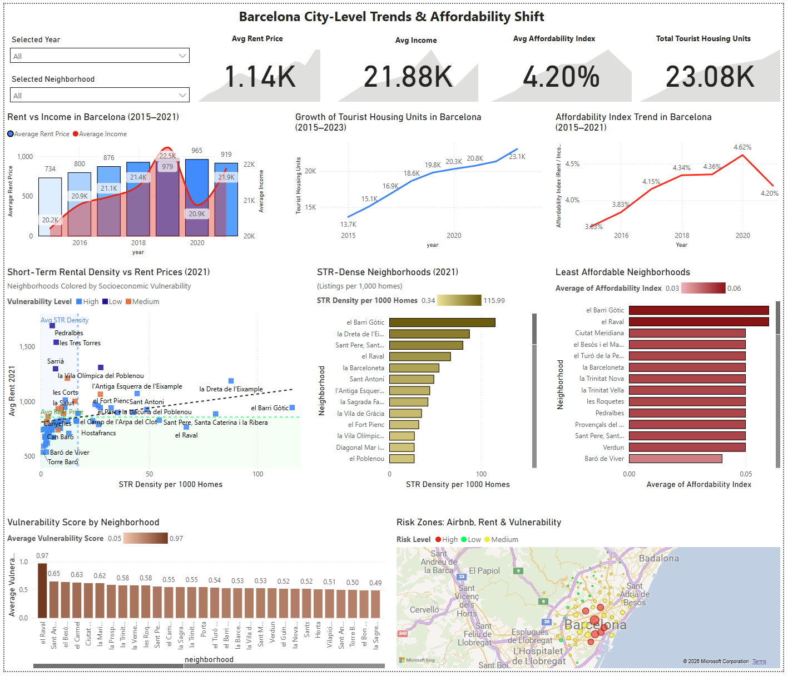

# 🏠 Barcelona Housing Affordability & Short-Term Rentals Impact Analysis

📊 **[View the Presentation Slides](https://docs.google.com/presentation/d/1IJ0028X29eiWIJ326kMdp_tu_LFPb9kWO5651I_9cRg/edit?usp=sharing)**  

## 🌆 Why This Project Matters
Barcelona’s cobblestone streets and Gaudí architecture draw millions of visitors each year — but for locals, the city’s beauty hides a growing crisis.  

**Rents have surged. Incomes haven’t kept pace.** And short-term rentals like Airbnb have become a lightning rod in the debate over who gets to live in the city center.  

In recent years, entire apartment blocks have shifted from long-term homes to tourist accommodations. Neighborhoods once known for tight-knit communities now see suitcase wheels rolling by at dawn.  

This project asks a simple but urgent question:  

> **Are short-term rentals making it harder for Barcelonans to afford to live in their own city?**  

Through data from **InsideAirbnb** and official Barcelona statistics, this project explores the link between **STR saturation**, **rent pressures**, and **neighborhood vulnerability** — uncovering where affordability is eroding fastest.  

---

## 📌 Overview
This project investigates **how short-term rentals (STRs) impact housing affordability in Barcelona**, focusing on the interplay between **Airbnb activity**, **rent prices**, **income trends**, and **neighborhood vulnerability**.  

The analysis combines **open datasets** from InsideAirbnb, the Ajuntament de Barcelona, and other official sources to explore whether STR concentration correlates with rising rents and declining affordability.  

It was developed as a **final portfolio project** for a Data Analytics Bootcamp, with an emphasis on **real-world policy relevance** and **data storytelling**.  

---

## 🎯 Project Objectives
- **Quantify STR growth** over time and its geographic distribution.  
- **Compare Airbnb presence to official HUT (tourist license) data** to assess compliance.  
- **Analyze neighborhood-level rent trends** and their relationship to STR density.  
- **Track changes in housing stock, occupancy, and tenure** over the past two decades.  
- **Identify vulnerable neighborhoods** (low income, high unemployment) and evaluate whether they are disproportionately affected.  
- **Measure affordability trends** by comparing rent growth with income growth.  
- **Produce a final “Risk Zone” classification** highlighting areas most at risk of affordability loss due to STR saturation.  

---

## 🗂 Data Sources

| Dataset | Source | Description |
| --- | --- | --- |
| **Airbnb Listings (March 2025)** | [InsideAirbnb](http://insideairbnb.com/get-the-data.html) | Neighborhood-level STR data (location, price, availability, license). |
| **Rent Prices (2000–2024)** | Ajuntament de Barcelona API | Average monthly rents at city, district, and neighborhood levels. |
| **Income Data (2015–2021)** | Ajuntament de Barcelona | Disposable household income at neighborhood level. |
| **Unemployment Data (2009–2025)** | Ajuntament de Barcelona | Yearly unemployment rates (district and neighborhood). |
| **Housing Stock & Occupancy (2001–2021)** | Ajuntament de Barcelona | Housing units, primary residence share, tenure types. |
| **Population Data** | Ajuntament de Barcelona | Population counts for growth vs housing supply analysis. |
| **HUT Licenses** | Generalitat de Catalunya | Official registry of tourist housing licenses. |

---

## 🛠️ Tools & Technologies
- **SQL (MySQL)** — Data storage, cleaning, and integration  
- **Python** — Data analysis & EDA (`Pandas`, `Matplotlib`, `Seaborn`)  
- **Power BI** — Dashboard creation & storytelling visuals  
- **Excel** — Quick exploratory summaries  
- **GeoJSON / Mapping** — Spatial distribution analysis  

---

## 📊 Key Analysis Chapters
1. **Airbnb & HUT License Compliance** – Comparing listings with official licenses to highlight high non-compliance neighborhoods.  
2. **Spatial Snapshot (2024)** – STR concentration vs rent prices at neighborhood level.  
3. **Housing Occupancy & Tenure Changes** – Long-term trends in primary residence share and rental tenure.  
4. **Socioeconomic Vulnerability** – Composite vulnerability index (income + unemployment).  
5. **STR Growth Over Time** – City-level STR growth rates over the years.  
6. **Connecting STR to Rent Pressures** – Correlation analysis between STR density and rent levels.  
7. **Affordability Index** – Tracking rent-to-income ratio (2015–2021).  
8. **Final Risk Zones** – Combined STR, rent, affordability, and vulnerability metrics to classify neighborhoods.  

---

## 📌 Dashboard Preview

  

The Power BI dashboard includes:
- Interactive neighborhood maps for STR density, rents, and vulnerability  
- Trend charts for rent, income, and affordability index  
- Housing stock growth vs population growth comparisons  
- Final risk zone summary table  

---

## 📂 Repository Structure

barcelona-housing-affordability/

│

├── data/ # Raw & cleaned datasets (where permitted)

├── sql/ # MySQL scripts for data integration & views

├── notebooks/ # Python notebooks for EDA & analysis

├── visuals/ # Charts, maps, and dashboard screenshots

├── dashboard/ # Power BI .pbix file

└── README.md # Project documentation

---

## 🚀 How to Run the Project

1. **Clone the repository**

   git clone https://github.com/yourusername/barcelona-housing-affordability.git
   
   cd barcelona-housing-affordability
   
3. Import the SQL scripts into MySQL

4. Run the Python notebooks for analysis

5. Open the Power BI file in /dashboard to explore visuals

---

## 📈 Key Insights
- Neighborhoods with high STR saturation (e.g., El Raval) tend to have higher rents and lower licensing compliance

- The rent-to-income ratio has deteriorated steadily from 2015–2021, with a sharper drop after the pandemic

- Vulnerable neighborhoods face compounded pressure: economic precarity + STR-driven rent inflation

---

## 📜 License
This project is for educational and research purposes only.
Data rights belong to their respective owners.

---

## 👩‍💻 Author
Tolga UNAL – Data Analyst | Urban Data Enthusiast

